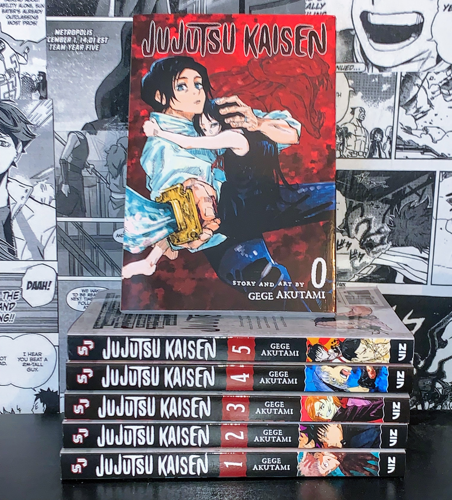
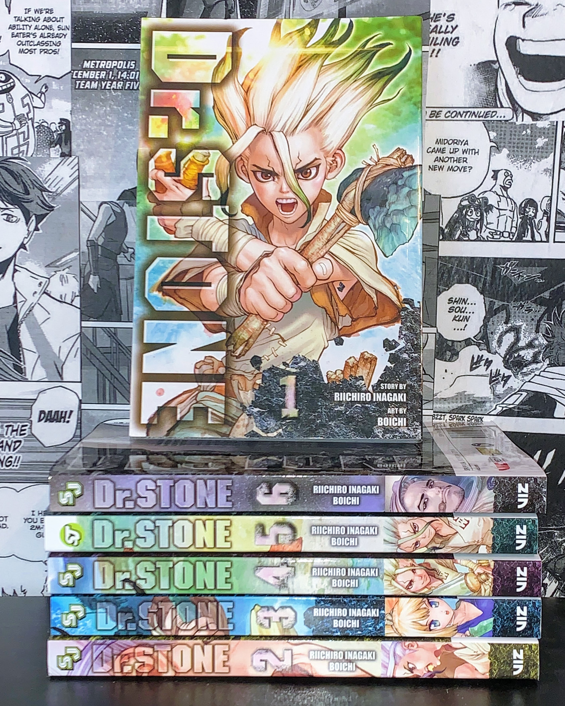
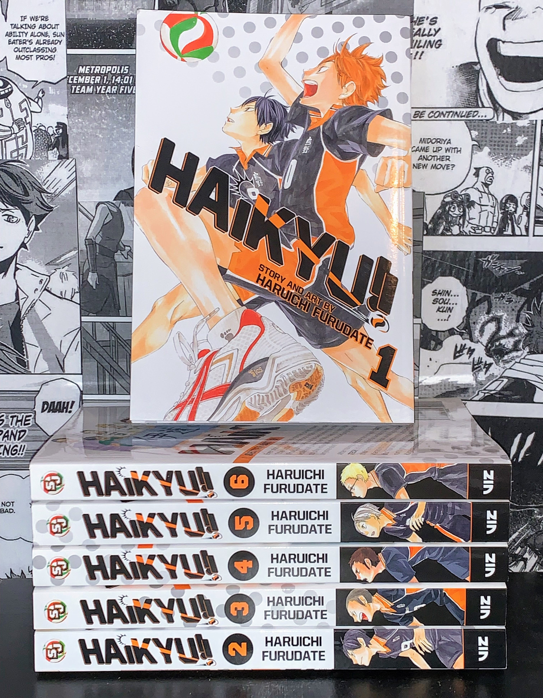
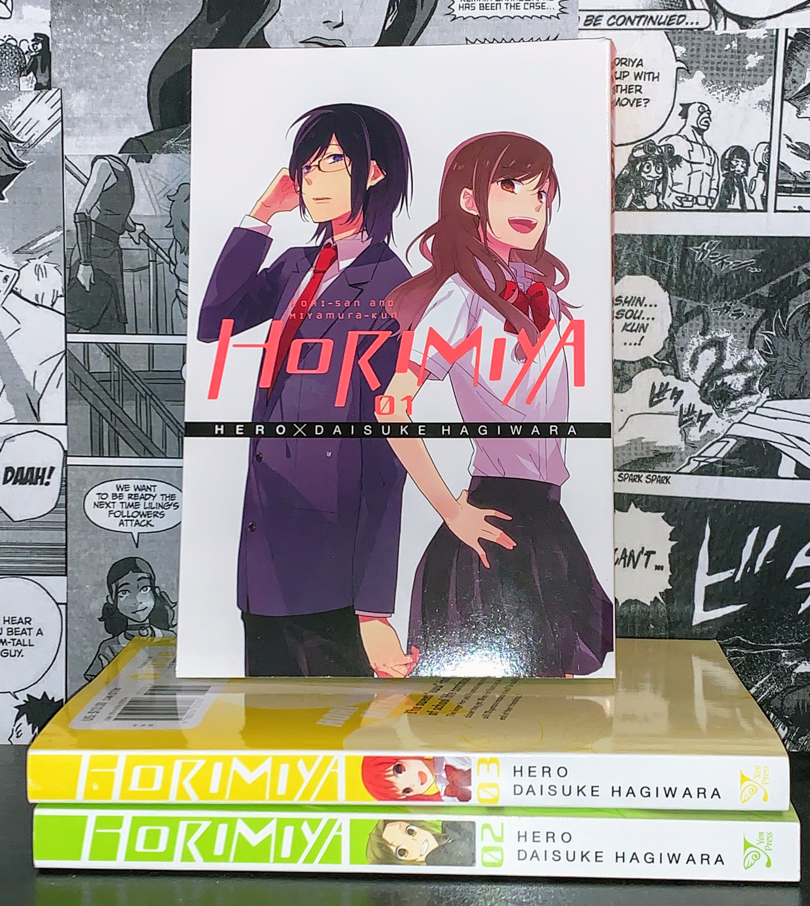
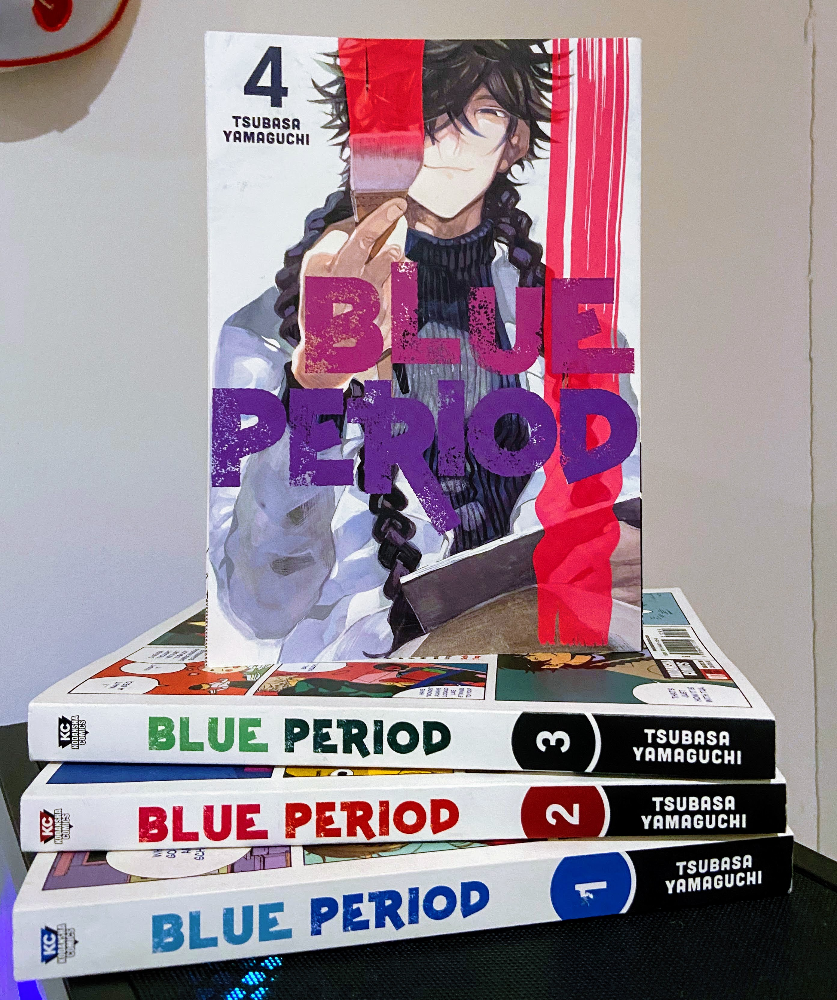
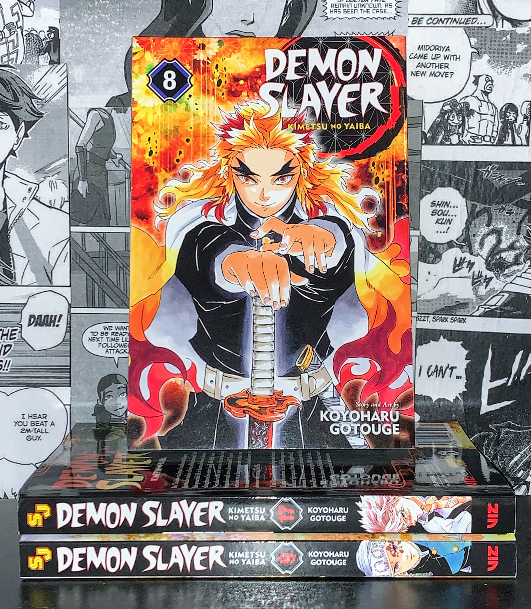
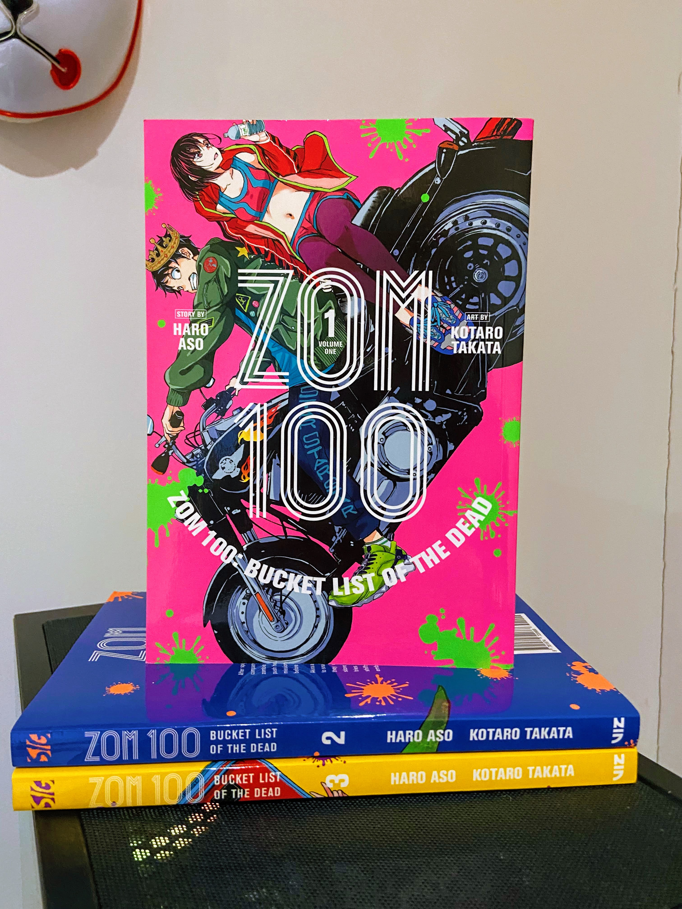
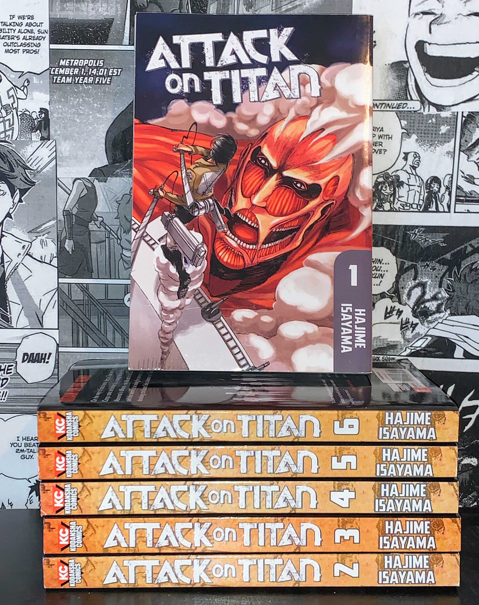
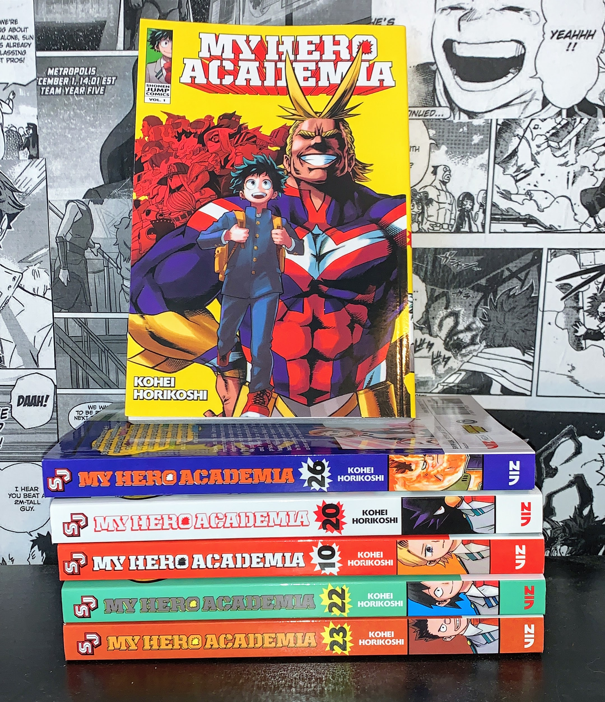
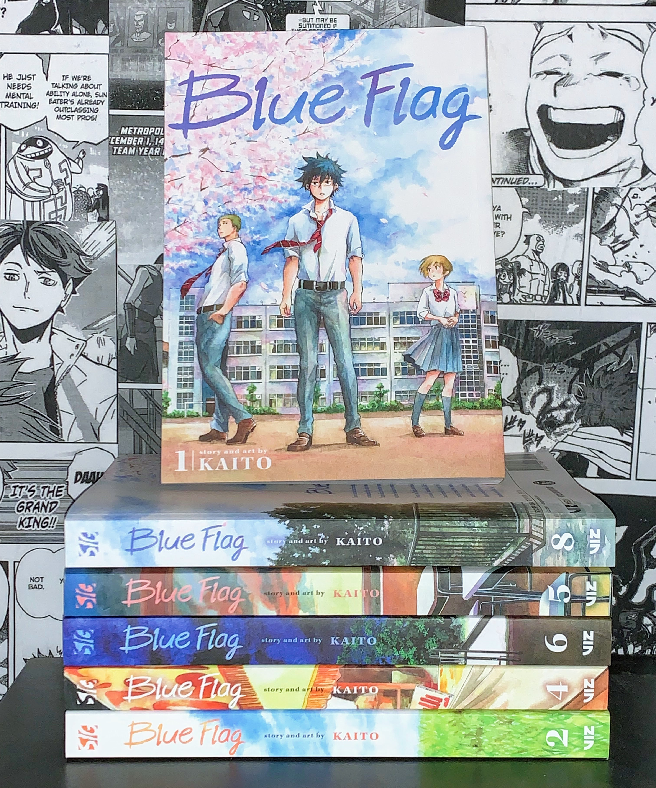

  Yes, the most important thing that differentiates manga series and helps them stand out is the design used for the titles. Whether it's the same as the anime or original to the printed manga, it sure helps to see the title on the cover or spine in all its glory. 

  That being said, where is incorporating a specific design of series done well on printed manga, and where is it done quite badly? I will be showing 5 examples of each (good vs. bad) that I have seen through my adventures of both buying physical copies of manga and watching their anime counterparts. All examples and pictures are from my own personal collection that I have both at my flat in the UK and my parent's house in the USA.

## The Good:

#### 1. Jujutsu Kaisen

The typography of the title of *Jujutsu Kaisen* is very unique.  It was taken directly from the anime, and I think the English physicals did a very good job converting the design to the spine and cover so it was clear and easy to read. The spines definitely stand out amongst the rest of the books on a shelf, which I always enjoy (especially when it's one of my favourite series). The numbers of the volumes also have the same kind of font to the title which I think brings a lot more the overall cohesiveness of the series on a shelf, and the colourful cover designs on the side really pull it all together. 

The cover with the title looks gorgeous too, and doesn't take too much away from Akutami's art on the cover. The way the black logo is outlined with white is a super cool touch as well that I personally really like looking at. Within the title, it's cool that all of the letters are all different sizes and shapes but all mesh together really well! It just suits the series, I think. It looks kinda creepy or Halloween-y. 

#### 2. Dr Stone

*Dr. Stone*'s art has to be one of my favourite styles I've seen throughout manga, and the incorporation of the title to the covers and spines has to be one of the best I've seen typographic-wise. I absoluely appreciate how the letters look almost hollow with a shadow outlining them so you can still see the art behind it. This is probably the only series I've seen do this successfully, and I'm a big fan of it. The variety of the colours and designs on the spines flow really well in comparison to others I've seen (later in the bad category :0) and the way the numbers look kind of like stone is a really cute touch. I think I just love the typography on *Dr Stone*'s physical releases. It gives a very science-fiction and futuristic feel, which portrays the story wonderfully. 

#### 3. Haikyu!!

*Haikyu!!* is one, if not the most, popular sports anime/mangas of today. The logo from the anime and manga is very distinct too, and I absoluetly love how they converted into the physical copies. The way the logo follows Hinata's leg on the cover is very pleasing to the eye, and the way the title has the actual colours of the main volleyball team, Karasuno, within it is super dope. The fact that the second exclamation point in *Haikyu!!* is a volleyball is so adorable. The actual font also feels very sports-like, which is on-par for what the series is about. Just very sporty and not super serious in general. 

I also want to point out that they put the *Shonen Jump* logo into a volleyball on the spines - yes I like it a lot but they're always printed in different sizes and it really annoys me. 

#### 4. Horimiya

*Horimiya*'s typography is on this list because I'm selfish and only care about my opinion (aka I like staring at it). The spines are colourful, the layout on the covers is pleasing to the eyes, and the actual font of the title is super unique. One of my favourite things, however, is that the title on the spine looks like it's been erased from the either pink, green, or yellow, which, of course, makes the spines look super nice and stand out on the shelves. Every volume in the 16-volume series has a different colour (except the last to pay homage to the first volume) so they certainly stand out either at a bookstore or in one's personal collection.

A lot of manga covers also kind of put the authors name in a corner, but I really like how its within a black line going across the entire cover. The font change between the character names, title, volume number, and author's name was executed well in almost a childish way, which I feel like shows the light-hearted-ness that this series brings with it. The typography is perfect for a modern, teenage, kinda-silly romance manga. 

#### 5. Blue Period

*Blue Period* is a manga about art, and the typography of the title looks like it. The uniform, but still creative, font mixed with bright colors and 'painted on' appearance helps an interested reader get a feel for what the story is actually about. The spines are simple in comparison to others, but the bright colours stand out against the white background and draws your eyes to the title. 

On the covers, I also love how the characters look like they are kind of painting it on. Volume 4 (the one on top) has the character Haruka Hashida on it. Yeah. I like him a lot. That's it. 

## The Bad:

#### 1. Demon Slayer

I feel like someone on TikTok would cancel me for this, but I do not like how *Demon Slayer'*s titles look on the physical releases of manga. It's just, condensed, and in a weird part of the cover. Yes the art is gorgeous, but it looks very out of place and the 'English' Japanese title under the big '*Demon Slayer*' looks weird. The actual font doesn't bother me too much, though, but it doesn't really fit the series. The Japanese logo looks better. 

The spines aren't horrible, just boring. On my shelf I have these volumes next to my *Jujutsu Kaisen* series and they kinda blend together. The red volume numbers with the pitiful, tiny white outline just blends into the black and looks weird from far away. 

#### 2. ZOM100: Bucket List of the Dead

There are two questions I have with the typography on this series: Why are the lines so thin? And why print a yellow cover with these said thin white lines where you can't even see the logo? Also, kind of unrelated to the actual typography, but why is the title so long? It looks stupid on the spines. They should of just made it one bold font instead of three little lines on the spine, it would of looked the same. 

However, I absolutely love how the title looks on the cover. I like the arc of the second part of the title underneath the big '*ZOM 100*'. It's really just the spines that bother me when I look at them on my shelf. The font doesn't really represent the series all that great (it's about a zombie apocolypse) but it doesn't really annoy me because it is sometimes a bit more humourous/light-hearted.

#### 3. Attack on Titan

I don't really have much to say for this one other than it's ugly and TOO consistent. I guess it matches the series, but it's ugly and I hide them on my shelves because I hate the colour of the spines. The font is so gross though and placed strangely on the covers. I hate it... It's a shame because *Attack on Titan* is one of my absolute favourite series ever. 

However, the French editions are so cool and I wish the English release spines looked like them. I'm too lazy to find a picture so if you want to see them then look it up on Google, idk. 

#### 4. My Hero Academia

This is the most inconsistent series ever when it comes to typography. Every single volume has the same font for the title, but they are all different colours and filled in differently. Not to mention, there is mutliple white and black background volumes, where the title is just an outline. 

On my shelves I have the entire series in rainbow order because I could not STAND to look at it in number order: the colours are too clashing and there is too many inconsistancies. That being said, the actual font of the logo is super cool and fits the superhero story very well. I just wish the volumes were more like *Jujutsu Kaisen* or *Chainsaw Man.*

#### 5. Blue Flag

I love this series and it made me sob, but the font of the title makes me sob even more. It's just, ugly. I feel like the designers were trying to go for a 'handwritten' vibe but didn't accomplish it very well. The spines are gorgeous other than the title, and I really like the font of the author's name and volume numbers. 

This series is quite serious, so I feel like the font kind of downplays the more emotional themes present in the series. The English design team at Viz Media should of used the font of the author and numbers for the title. I feel like it would fit it better. 

On a kind of related note, I almost didn't buy this series because of the title font. It's kinda dramatic but I felt like it looked off-putting above the soft and pretty art.