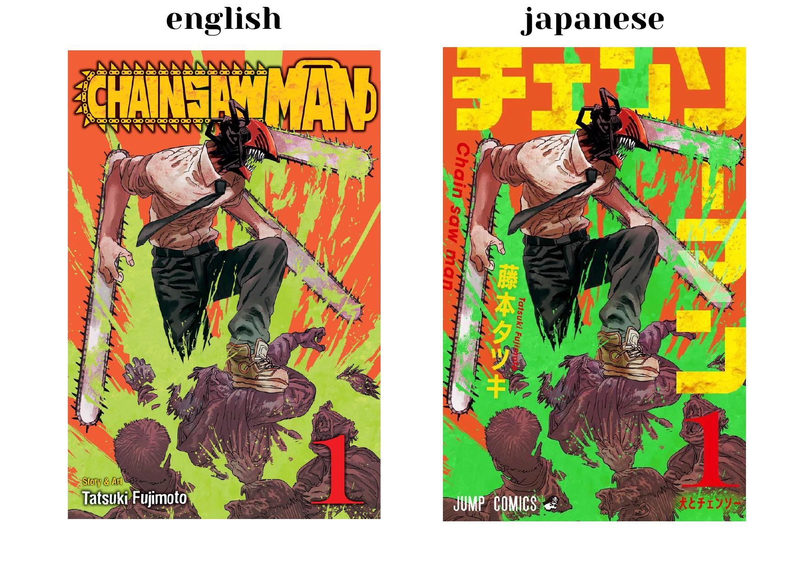
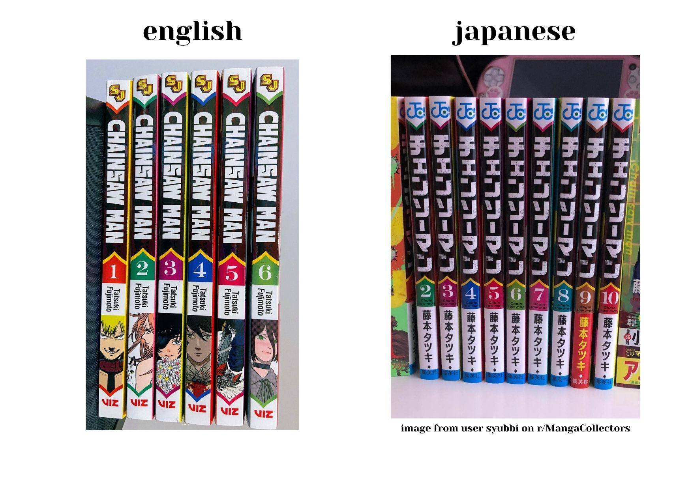
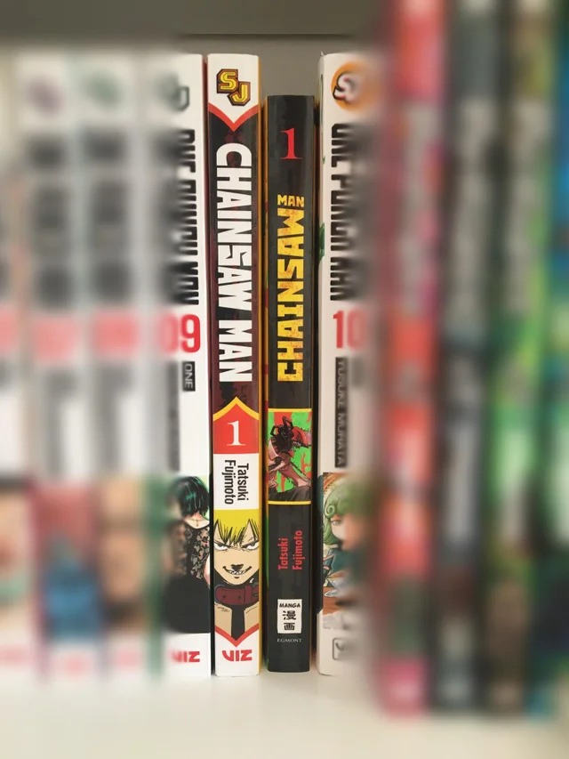
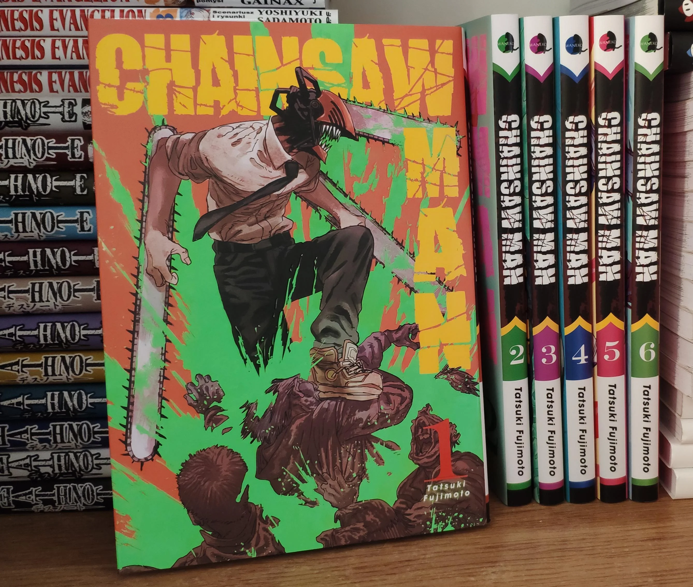

   The typography used on manga covers and/or spines is some of the most creative and (usually) the most pleasant designs among a good deal of published media in today’s bookstores. They stand out with their eye-catching colours, interesting fonts, and consistency between volumes of the same manga.

   In the United States, United Kingdom, and any other majority English-speaking country, manga spines line the shelves of popular bookstores such as Barnes & Nobles or Waterstones, with their eye-catching spines standing out to interested guests. Viz Media, Yen Press, and Kodansha Comics are all major USA-based publications that bring these manga from Japan and to the English-speaking world and into the hands of readers.   

  The three major publishing companies each run a multitude of different series, translating every single one of them from the native Japanese language to English. Because of this, obviously, the design on the covers and spines are going to have to be redesigned to cater for a Western audience. 

   Take one of the most popular series these days, Chainsaw Man by Tatsuki Fujimoto. In the Japan version, the font of the series title on the cover and spine are completely different in comparison to the English copies printed by Viz Media.

   On the cover, the Japanese title is in a big, bold, yellow font that catches the eye and almost feels like it’s yelling at you, which is a great indicator of what the actual story is kinda about. In comparison, the English copy looks a little more downplayed, but still very eye-catching. The novelty of the title being placed into a chainsaw is something I absolutely LOVE, and I can really appreciate how the Viz Media typographers were able to do that. 

   The spines on the two are quite different as well, as the Japan copy’s font looks very distressed or worn off, whereas the English copy’s looks more traditional with a little bit of eclecticness through the varying contrast. The English versions also have little snippets of characters’ faces, which I really enjoy but the Japanese versions do not have. 

   Chainsaw Man has not only been printed in Japanese, however. It is also available in French, Italian, Spanish, Polish and German (as well as many other languages within the EU), with slight changes between each of them on the covers. However, the spines on all of them are completely different. 

   The biggest difference on the cover of the European printed copies in comparison to the English copies is the title, which is printed very similarly to the Japanese print versions but in English. The words are in the same bold and yellow letters that span the entire cover and stand out against the orange background. 

   The spines of every single language printed is completely different though - there are too many different variations to count! However, I will show two of my favourites and why I like the typography on them.

### 1. Germany

   I just think this spine (pictured right below) looks so cool. The full black with the snippet of the cover and the layout of the distressed yellow text shows a good preview of what the story is inside. The singular ‘1’ to show the volume number on top looks a lot nicer than how (in my opinion) the English versions look. The way the title is laid out on the spine is very interesting as well, and is something I’ve only seen on the German versions of the print manga.

### 2. Polish

   The spines of the Polish versions IS SO COOL! I love how the title looks like its been slashed with a chainsaw (que Denji*) and how it is similar to the English printings but spiced up a little. I honestly wish the English versions were printed with the ‘beaten and bruised’ typography on the spines, but I miss the character faces on the Polish versions.

\*The main character of *Chainsaw Man* who is featured on the cover

