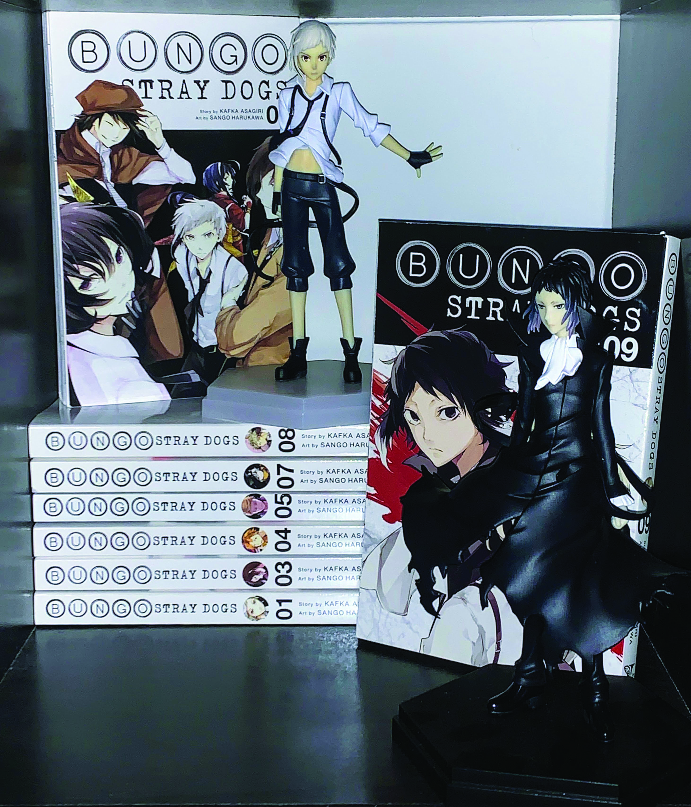
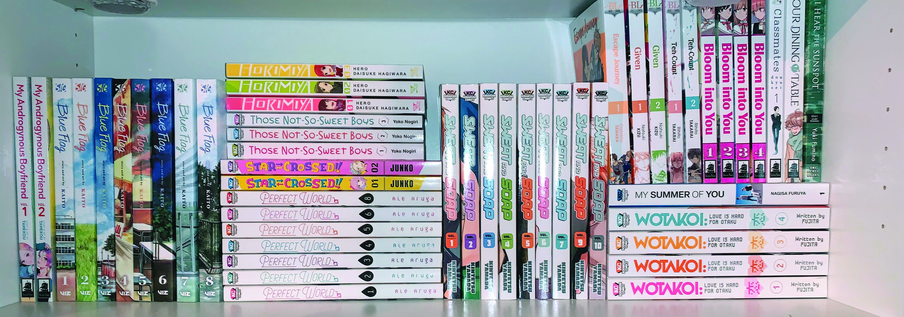

Especially in an age of social media and sharing one’s collections, it’s no surprise that physical releases of manga suddenly went through a boom of popularity, especially on Instagram and TikTok. As well as the general quality of the stories, the way the books look on the shelf, either separately or together, is very important to new-found collectors. 

Tall bookshelves lined with hundreds of colourful, thin books line the shelves of manga content creators on both TikTok and instagram with the creators only growing in followers day by day. Their videos get millions of likes as they show of their thousand-dollar plus displays for the world to see. I personally used to kind of be a creator on manga TikTok, so a lot of my mutuals and myself have quite expensive collections. Of course, we read most of them, but it’s not uncommon for your purchases to pile up before finally starting a specific series. 

Social media is dangerous though, and sometimes can create some bad spending habits for creators. For always wanting new content, buying and collecting manga gets very expensive. Creators feel like they always have to be the first, or always have the best collection instead of actual, productive content.Viewers of this content are at risk as well, as a lot of them are children or young adults that don’t have jobs, but want the access to this usually unattainable collections they see on the internet. 

Though, what makes these collections so appealing? Why are they so popular? 

In comparison to Japan, English or other Western designs of manga are often more aesthetically appealing to fans of the content. The typography on the spines of the books look very pleasing when on a shelf together, especially when someone has a full series together on the shelf. 

For example, the series Bungo Stray Dogs looks (in my opinion) extremely clean and put together on a bookshelf. The simple black and white with cool, circular typography on the sides is aesthetically nice to look at in comparison to a lot of other series in a similar genre. 

Romance series’ typography also usually look nice together on a shelf, with white backgrounds but unique and colourful fonts lining the side of each series. They look uniform, but not the same, which is why this genre is usually most common to show off in collecting communities. 

In the end, all collectors care about is the way things look on a shelf. Whether or not one reads them is an entirely different story, but it’s quite obvious that collectors prefer aesthetic typography over heavy and disorienting typography if looking at a shelf.