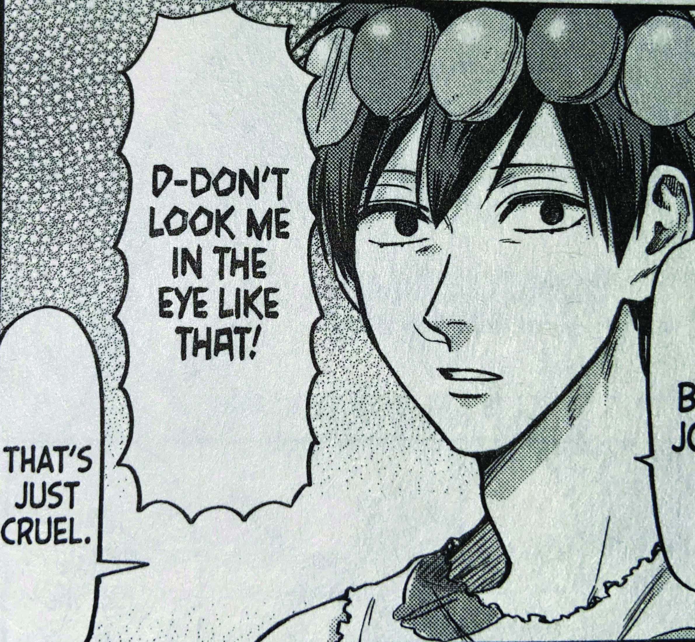

###### What does the typography inside of manga look like? How does it differentiate between series, publishers, and genres? Look *inside* to find out :)

## Sound

As well as just portraying dialogue, typefaces in manga can portray sounds using unique and bold fonts. Take Junji Ito’s *Gyo*, for example. The sounds pop out of the page in bold, black lettering to show further immerse the reader into the scene they are reading. The different words are each in a unique font that illustrates the sound effects perfectly.

## Emotion

Within dialogue, manga typesetters can use different fonts to get across emotions a character may feel or a tone they use while speaking. *Life Lessons of Uramichi-Oniisan* does this throughout the series as it is comedic and helps further the plot. In the example to the right, the harsh, almost carved-out font shows annoyance in comparison to the basic font in the bubble underneath.

## Characters

The typeface change between characters often shows off their personality. On the left, series *Chainsaw Man* shows off this method perfectly.  The characters Power, Denji, and the unimportant side characters all have different fonts while speaking. This, again, gives personality to the words on the page and allows differentiation while reading.

