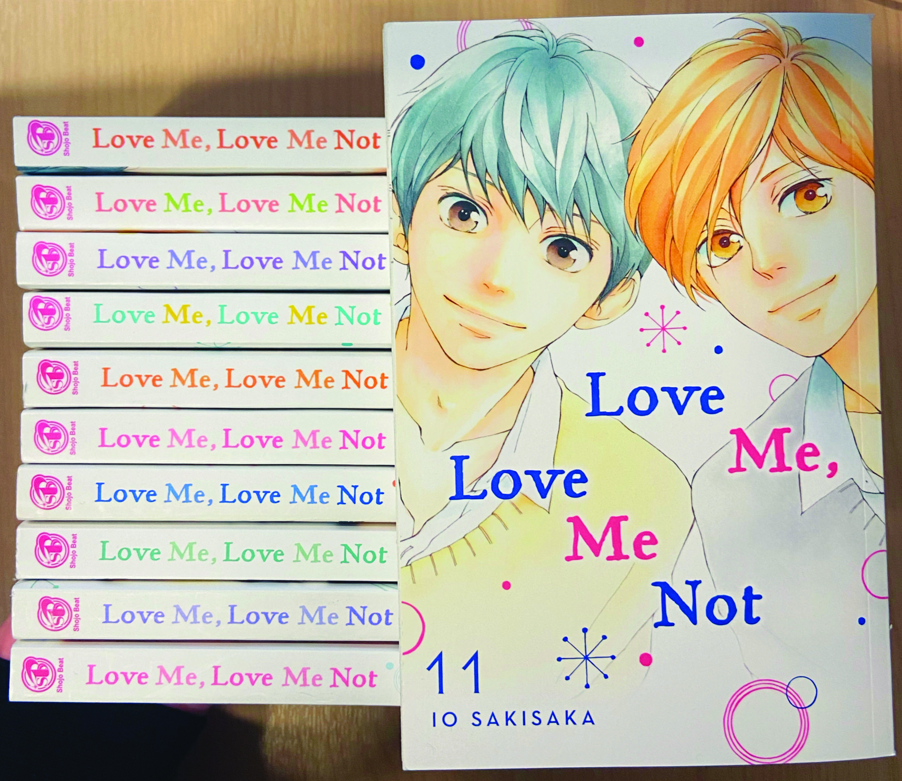
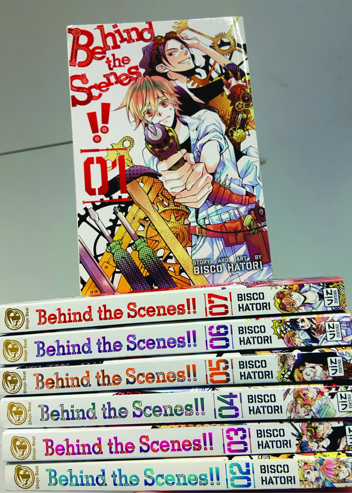
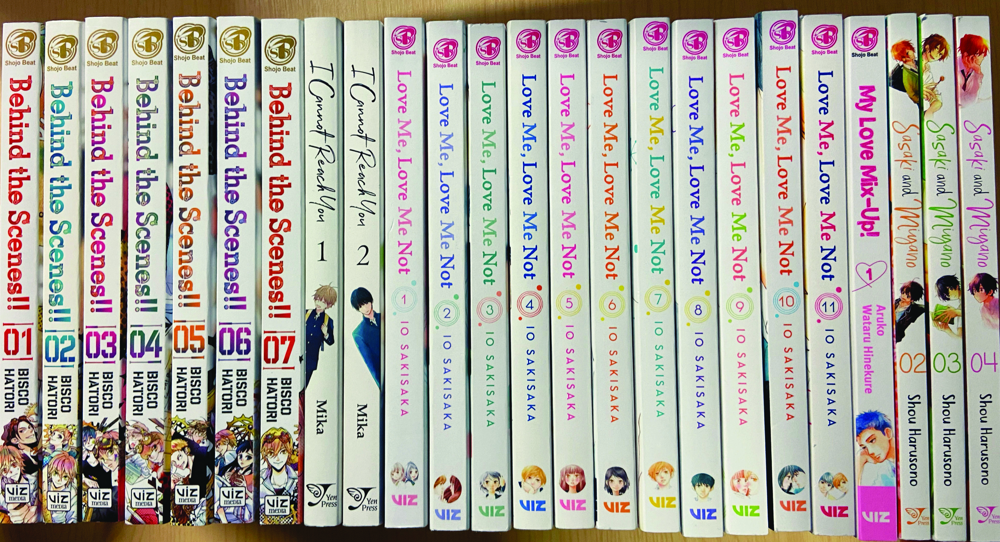
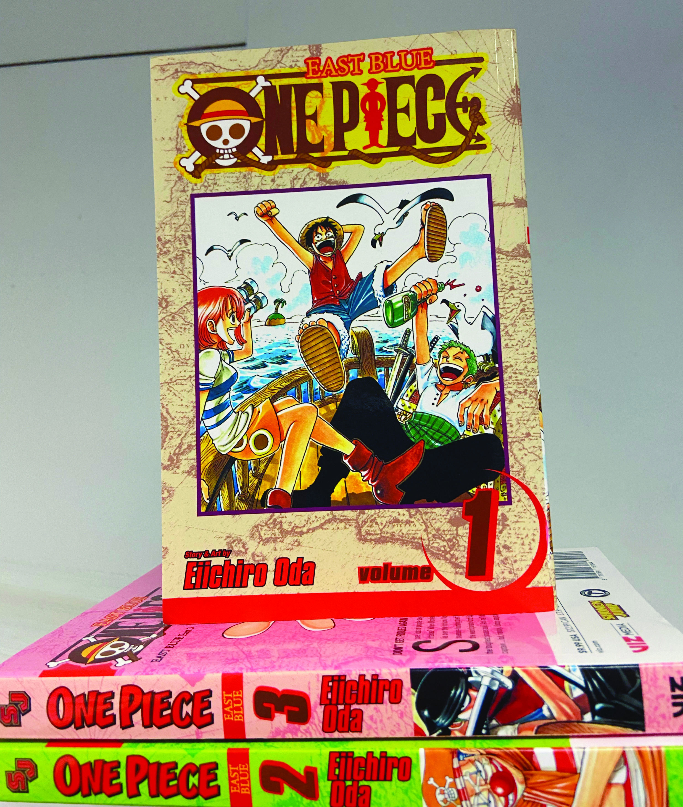
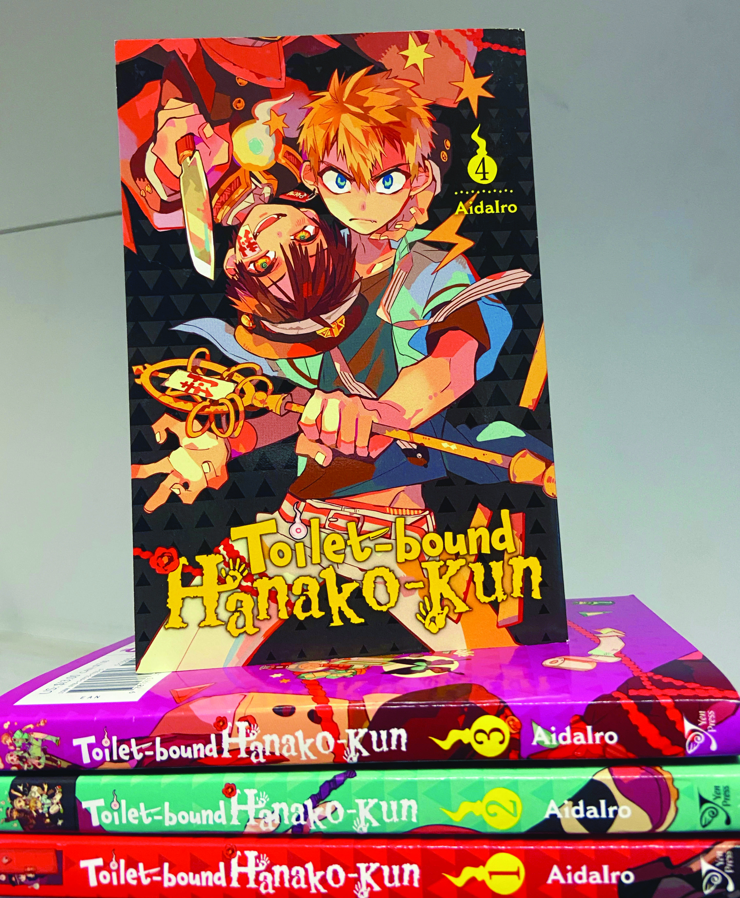
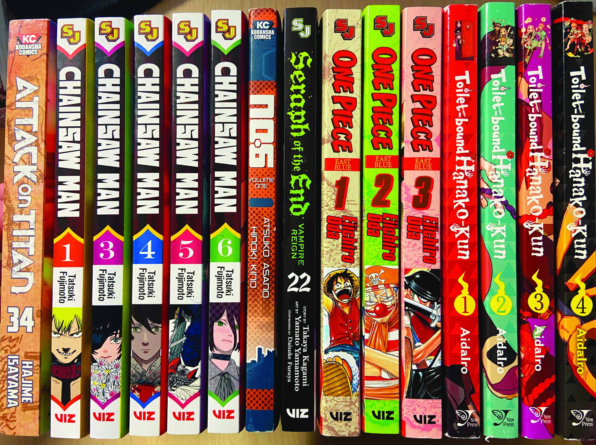

Physical manga publishers as a whole usually follow the same parameters when it comes to the volumes’ spine design and typography. The typical layout typically features the publication logos on the top and bottom of the spine, with the title, authors name, and a small picture of a character either under the authors name or right above it inbetween the logos. However, just by looking at my own collection, I have noticed there is actually quite a difference in how the spines are designed between more ‘shojo’ (female-appealing) series, versus ‘shonen’ (male-appealling) series.

## Shojo Manga Typography

Shojo, or the genre of manga that’s targeted towards a female demographic, has a very simple and streamline design on both the spines and cover. Shojo manga tends to have a plain, white background with either basic or cursive typography in charming colours on the spine. On the cover, it’s usually just one picture with the title, the author, and the volume number. 

One perfect example of this is Io Sakisaka’s series *Love Me, Love Me Not*. The spines are white, with the same tentative font for the title which is in contrast to the quite rigid styling of the author’s name. Each volume’s typography is a different colour, but they all mesh together quite well next to each other.

Moving away from romance, shojo series *Behind the Scenes* by Bisco Hatori still follows the same white-background and simple-coloured font combination, just adding in some elements into the typography to fit the fun-natured tech theatre series’ story. Even next to the streamline romance series, the spines fit in quite well.

A lot of shojo manga has this same layout/typography featured on their spines, and typically, different romance and shojo series in general still look nice together when placed on a shelf.

## Shonen Manga Typography

Shonen, or the genre of manga that’s targeted toward a male demographic, has a completely opposite design to shojo manga. With very bright, contrasting colours and crazy fonts, shonen manga tends to only look nice next to other volumes of the same series. 

Take the series One Piece by Eiichiro Oda, for example. Every volume has a different colour background with the same, bold and unique red title on the spine. It looks quite chaotic, as it seems there are a lot of elements pushed onto one spine. The colours of the typography are quite contrasting to the background as well, with the second volume’s bright green clashing with the red text. The cover title also has a completely different typography than the spine, which again, messes with the overall cohesiveness. 

Toilet-Bound Hanako-Kun is another great example of the popular ‘chaotic’ shonen layout. The picture of the cover wraps around to the spine, often coinciding with the white typography and making it hard to read. The typography of the spines/cover is very cool, but again, there is just so much going on with so many different colours it makes it hard to look good with other series. 

When putting shonen manga together on a shelf, it tends to appear very chaotic. Only singular series look good together (most of the time) and series in order can look out of order due to the typographic design on the spines.

It’s very clear when you put the two genres together which is which. When shopping in stores, it’s very obvious as to which series are targeted more towards men or more towards women.