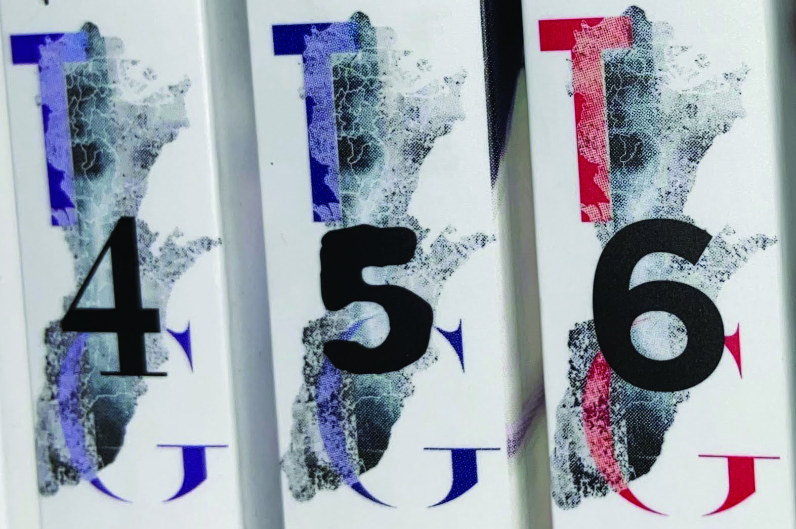
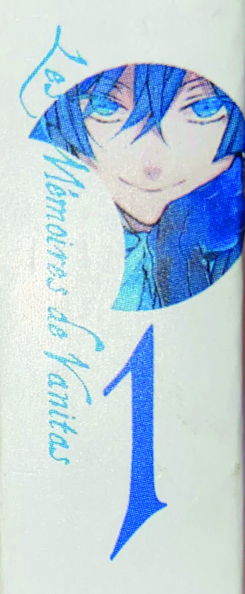
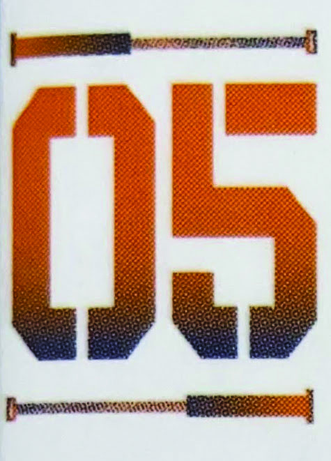
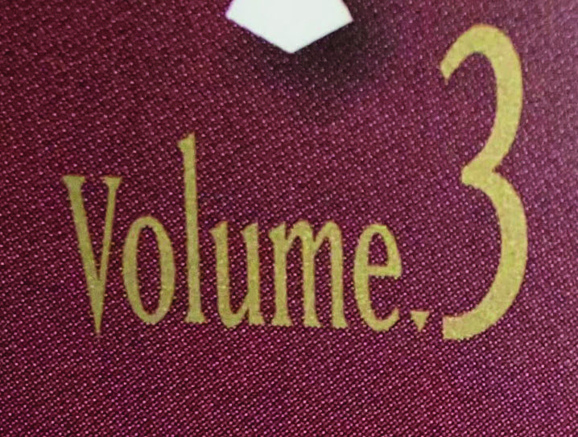
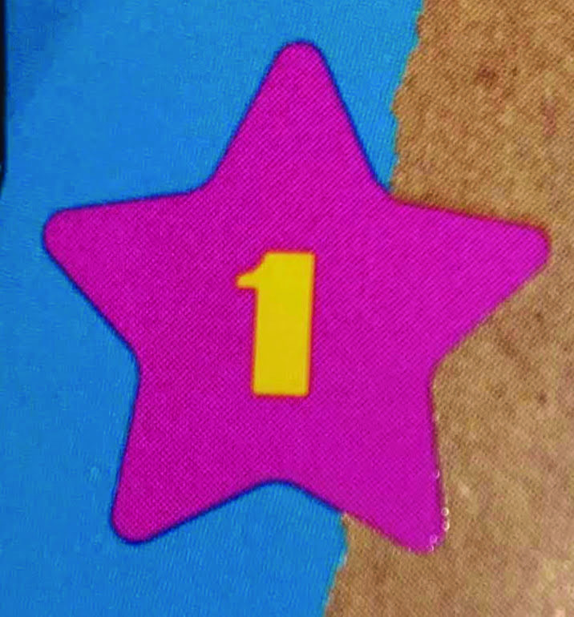

One of the most important aspects of every manga spine is the volume number. Of course, it mainly just allows the reader what number in the series a book is, but every series has a unique way of showing it through the typography used. Usually, in comparison to the titles or characters on the spines, it’s the first thing an interested reader is drawn to. The numbers, however, vary greatly from series to series. In comparison to the similar typography within genres, there is no real way to tell exactly what the numbers on a series will look like. 

Take *Tokyo Ghoul* by Sui Ishida, for example. On every single volume of the manga, the numbers used are completely different fonts. They range from rigid to casual, organic to digital. This being said, the extreme range of volume numbers used fits the series quite well, as the actual content is actually quite chaotic itself. Plus, the fact that it incorporates the logo and stands out against the background allows the volumes to be uniform, but distinctive when taken out by itself. 

## Further Examples:

*The Case Studies of Vanitas* by Jun Mochizukiis a special case when it comes to volume numbering. It’s very intricate, and the character portrait is included in the design. This is uncommon for manga, but definitely one of my favourites. I just looks very elegant and a little old-fashioned, which fits the series perfectly. 

*Behind the Scenes* by Bisco Hatori has a unique, but similar design to its other shojo counterparts when it comes to volume numbering. The bright colour against the white background is a very common trope for the genre, but the designers made the numbering more distinctive by making the numbers look stencilled on. This portrays the series quite well , as its about a university tech theatre group. 

This particular version of *Monster* by Naoki Urasawa is actually an omnibus edition, which has multiple single volumes of the original manga combined into one volume. In this case, the designers opted for the actual word ‘Volume’ to be on the side, as well as the actual number. This is not uncommon, especially with omnibus editions, but sometimes the actual number is written out instead of just a number. The actual typography on this series, though, is invigorating with the way the ‘V’ goes under the base line, and the ‘L’ that goes over the cap height. The v-height also seems quite high, which again adds uniqueness to the font. I also like the way the number ‘3’ is so big, so it still stands out on the spine of the manga when looking at it on the shelf. 

*Life Lessons with Uramichi-Oniisan* by Gaku Kuze is a series that centres around a children’s TV show host who hates his life. The bright, contrasting colours of the star and volume number on this series encapsulates that perfectly.  The child-like and glossy (kind of hard to see in the picture) star with the blocky and casual ‘one’ in the centre differentiates the series from others on the shelf all while successfully displaying the playful nature of the series. It doesn’t take itself too seriously, which again, is phenomenal typographic work for *Life Lessons.*